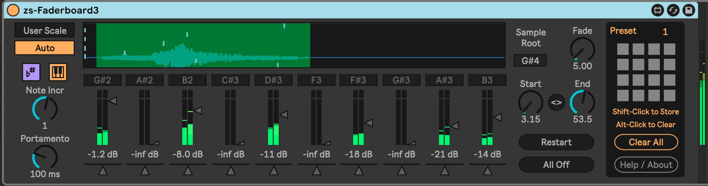

# zs-Faderboard3

This is a Max For Live device that seeks to replicate the functionality of the Vestax Faderboard. This device came to my attention via [Hainbach's Video](https://www.youtube.com/watch?v=E1Kr0EJwZ-c), and I was intrigued by the idea that the primary interface to a sample would be a set of faders.

Overall, this is an 8-voice pitched sample-playback device. The sample is triggered for a voice when that voice's fader is moved off of its `-inf Db` position. As long as the fader is above "silent" then the sample will play/loop, with volume controlled by the fader. The sample loop start/end is controlled globally, and if the start > end, then the loop plays backward.

Each voice's pitch and pan position is controlled independently. The pitch played is relative to the global sample "Root Note".

## Installation

Clone this repository, and drag the `zs-Faderboard3.amxd` device into a MIDI track in Ableton Live.

## Usage

The device needs an audio file to play, so you will need to either drag a file or an audio clip on to the section of the device labeled "Drop Audio Here".

Next, set the root note of the audio.

From there, you can move the faders to trigger playback of the audio at the pitch indicated above the fader.

You can also change the pan position of each voice with the horizontal slider below each fader.

To make fine adjustments of the loop points, hold down `Shift` while moving the knobs.

The "All Off" button will return all faders to the `-inf Db` position.

The "Restart All" button will force all playing loops to jump back to the beginning of the loop and continue playing.

## Attention to Detail

* Works with any well designed theme.
* Good Push / Push2 integration.
* Includes a touchOSC device definition file.
* Fully automatable, with sensible and consistent automation names.

## TODO

* Add optional looping.
* Musical scale presets.
* Timestretch control (global? per-voice?)

## Changelog

* 2022-01-16 Allow for multiple instances of the device in one Live Set.
* 2022-01-15 Proper Push / Push2 integration.
* 2022-01-11 touchOSC definition file (zs-Faderboard3.tosc)
* 2022-01-10 Bugfix for mono files, Restart All button
* 2022-01-09 Implement loop start/end points (with the possibility of reverse if start > end).
* 2022-01-08 Initial release

## Contributing

I'd love it if others extended this device. If you would like to contribute, simply fork this repo, make your changes, and open a pull request and I'll have a look.
